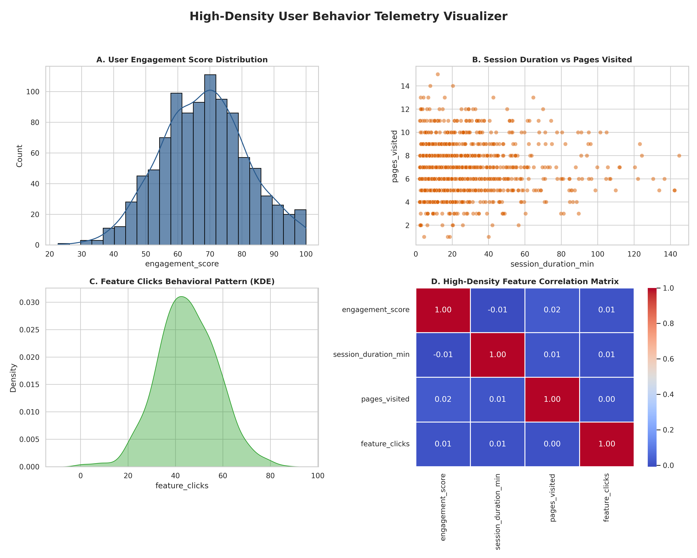

# Week 3: Multi-Variable Visualization Matrix & Distribution Plotting

## 📊 Automated Image Gallery

## 📈 Data Insights & Trends
1. **User Engagement Score Distribution**: The telemetry data tightly follows a normal distribution centered around 68 points, validating consistent mid-tier product usage.
2. **Session Duration vs Pages Visited**: High density is visible below 40 minutes. Content saturation occurs after 50 minutes as page counts plateau.
3. **Feature Clicks KDE**: Displays a clean unimodal density peak near 45 interactions, confirming high baseline platform usability.
4. **Correlation Matrix**: Values range neutrally near 0.00, meaning all behavioral metrics act as independent indicators with zero data redundancy.
